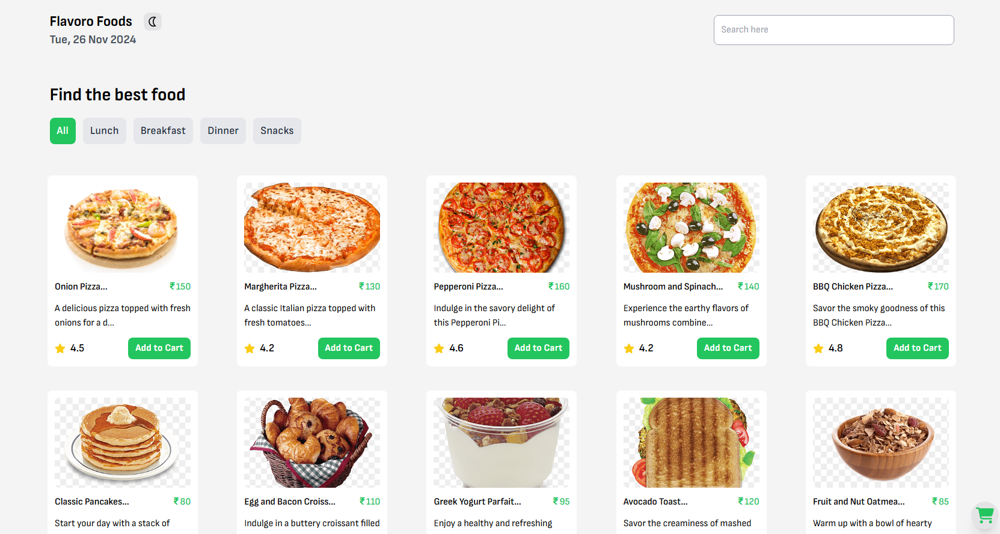

# Flavoro-Foods

### Project Description: Flavoro Foods Website

The **Flavoro Foods Website** is a modern, feature-rich frontend e-commerce platform built using **React** and **Redux**. This project offers a seamless shopping experience by implementing essential e-commerce functionalities and a dynamic user interface.

---

### Key Features:

1. **Protected Routes**

   - Certain pages are accessible only to authenticated users (e.g., checkout, user profile).
   - Ensures secure navigation and user data privacy.

2. **Cart Management**

   - Add and remove products from the cart with a single click.
   - Cart dynamically updates to reflect the total price and quantity of items.

3. **Category Sorting & Searching**

   - Sort products by categories for efficient browsing.
   - Search functionality to quickly find specific products.

4. **Single Product Detail Page**

   - Detailed view of individual products, including descriptions, prices, and reviews.
   - Displays similar products for enhanced product discovery.

5. **Similar Product Sorting**

   - Suggests similar items based on product category or user preferences.

6. **Theme Mode (Light/Dark)**

   - Toggle between light and dark themes for a personalized user experience.

7. **Popups for Notifications**

   - Responsive popups for actions like adding/removing items from the cart, successful checkout, etc.

8. **Checkout Page**
   - Streamlined checkout process with user-friendly forms and real-time cart validation.

---

### Technology Stack:

- **Frontend Framework**: React
- **State Management**: Redux Toolkit
- **Routing**: React Router DOM for navigation and protected routes
- **Styling**: CSS Modules, or styled-components for dynamic theming
- **Persistent Data**: LocalStorage (for cart and theme preference)
- **Dynamic UI**: Context API (for theming and popup controls)

---

This project lays the foundation for a scalable and user-friendly e-commerce platform. Future enhancements can include backend integration for real-time data and payment gateway setup.

#### Project Screenshot :

## 

#### Project Live Demo :
